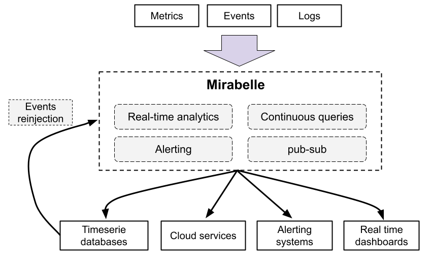

# Mirabelle

Mirabelle is a stream processing engine which can be used to aggregate events, metrics, logs and traces.

Its powerful and extensible DSL allows you to define computations on a stream of data. Mirabelle offers natively a lot of functions (time windows, mathematical operations, transforming data, relabeling, etc.) which can be easily combined according to your needs.

It can be used for a lot of use cases like monitoring, fraud detection, alerting, to route events and metrics between different systems…

Check the documentation (https://www.mirabelle.mcorbin.fr/) for more information !

This project was inspired by Riemann (https://riemann.io/), which is licensed under Eclipse Public License 1.0. Some functions and components from Riemann were reused in Mirabelle.
